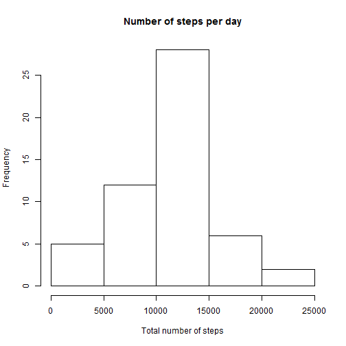
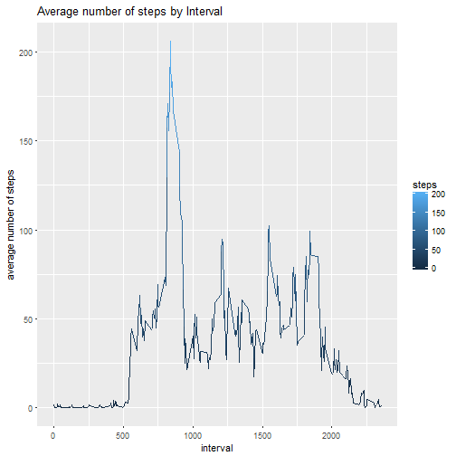
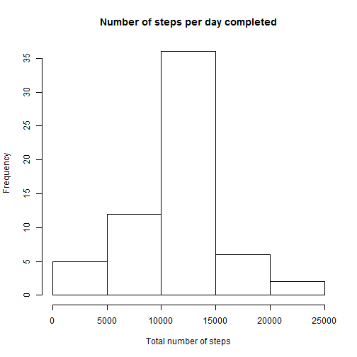
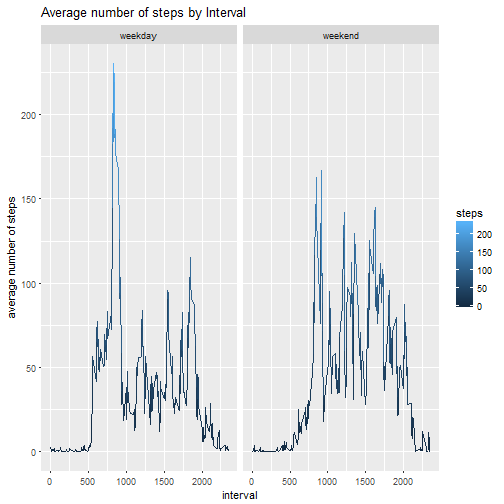

# Reproducible Research: Peer Assessment 1


## Loading and preprocessing the data
##### 1. Load the data (i.e. read.csv()) and clean the NA values
##### 2. Process/transform the data (if necessary) into a format suitable for your analysis

```r
data = read.table(file = "./activity.csv",header=T, quote="\"", sep=",")
data$date <- as.Date(data$date)
row.has.na <- apply(data, 1, function(x){any(is.na(x))})
dataClean <- data[!row.has.na,]
```
## What is mean total number of steps taken per day?

```r
daySteps <- tapply(dataClean$steps, dataClean$date, sum)
```
##### 1. Make a histogram of the total number of steps taken each day

```r
hist(daySteps, main="Number of steps per day", xlab="Total number of steps")
```


##### 2. Calculate and report the mean and median total number of steps taken per day

```r
meanSteps <- mean(daySteps)
medianSteps <- median(daySteps)
```
* Mean: 10766.19
* Median:  10765


## What is the average daily activity pattern?

```r
avg_steps <- aggregate(steps ~ interval, dataClean, mean)
```
##### 1. Make a time series plot

```r
ggplot(avg_steps, aes(x = interval, y = steps)) +  geom_line(aes(group = 1, col = steps)) + ylab("average number of steps")+ xlab("interval") +  ggtitle("Average number of steps by Interval")
```




##### 2. Which 5-minute interval, on average across all the days in the dataset, contains the maximum number of steps?

```r
max_interval <- which.max(avg_steps$steps)
intervalMostSteps <-avg_steps[max_interval,]$interval
```
* The interval with most steps is: 835


## Imputing missing values
##### 1. Calculate and report the total number of missing values in the dataset 

```r
missing <-nrow(data[row.has.na,])
```

* Number of missing values: 2304

##### 2. Devise a strategy for filling in all of the missing values in the dataset.
##### 3. Create a new dataset that is equal to the original dataset but with the missing data filled in.

```r
for (i in 1:nrow(data)) {
    if(is.na(data$steps[i])) {
        val <- avg_steps$steps[which(avg_steps$interval == data$interval[i])]
        data$steps[i] <- val 
    }
}
```
##### 4. Make a histogram of the total number of steps taken each day 

```r
dayStepsFull <- tapply(data$steps, data$date, sum)
hist(dayStepsFull, main="Number of steps per day completed", xlab="Total number of steps")
```


##### 4.1 Calculate and report the mean and median total number of steps taken per day. 

```r
impMean <- mean(dayStepsFull)
impMedian <- median(dayStepsFull)
```
* Mean with completed values: 10766.19
* Median with completed values:  10766.19

## Are there differences in activity patterns between weekdays and weekends?
##### 5. Create a new factor variable in the dataset with two levels - "weekday" and "weekend" indicating whether a given date is a weekday or weekend day.

```r
data$day <- weekdays(data$date)
data$day[data$day  %in% c('domingo','sábado') ] <- "weekend"
data$day[data$day != "weekend"] <- "weekday"
data$day <- as.factor(data$day)
avg_stepsFull <- aggregate(steps ~ interval + day, data, mean)
```

##### 6. Make a panel plot containing a time series plot

```r
ggplot(avg_stepsFull, aes(x = interval, y = steps)) +  geom_line(aes(group = 1, col = steps)) + ylab("average number of steps")+ xlab("interval") +  ggtitle("Average number of steps by Interval") +facet_grid(scales="free", space="free", .~day)
```


